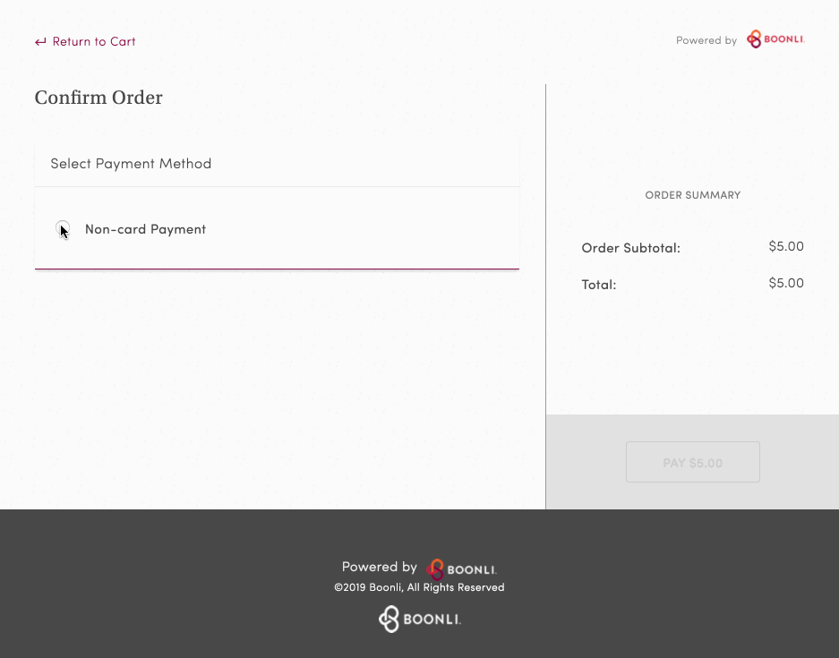

# Boonlificent

**Note:** Boonli has made some changes to their UI that broke the extension... and with COVID-19 and not working from the office for at least the near future (and therefore not using Boonli), I haven't had the motivation to fix or improve the extension. I'll unarchive this repo if we return to the office and using Boonli.

Auto payroll deduction helper for Boonli

## More Info

Boonli is a food service app that allows employees to order lunch through a company sponsored program (at least in my case; I think it can be used for many things).

Every time I order, I have to click a button to say that I'm using a payroll deduction as my payment option and then copy and paste the text "Payroll Deduction" into a field.

It's annoying so... I made this simple chrome extension to make that a thing of the past.

## How to Install

### Normal Way

-   Go to [download link](https://chrome.google.com/webstore/detail/boonlificent/eiopcolccklfeplgjkidcjgdbociafmg) on Chrome
-   Click "Add to Chrome"
-   Enjoy

### 1337 Hacker Way

-   Go to the [Chrome extension manager](chrome://extensions)
-   Switch on "Developer mode" at the top of the page
-   Clone/fork this repo
-   Choose "Load Unpacked" and select the repo directory from your file explorer
-   Hack the planet
